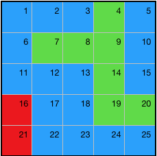
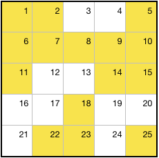

# MATRIX-MAP

*SPECIAL NOTE: Throughout this README you will see various images. These are purely aids to conceputually visualize how the package works. Matrix-Map on its own is not capable of rendering any graphics*

# Repository
The code for the project can be found here: https://github.com/RaptorCentauri/matrix-map

# Description
Matrix-map creates a Class Object of a given size as a perfect square. It helps to visualize it like so:

Each space in the Matrix has its own unique id. Starting at 1 in the top left corner and incremening by 1 left to right until the end.

Here is a visual representation of the Matrix, with the id in each square;

Each space also contains a value. When the matrix is first created, each value is null, but it can be set to anything.

Methods and properties will be explained further down. First lets get it installed.

# INSTALATION
~~~
npm install matrix-map
~~~

# SETUP

First, import the package.

~~~ javascript
import Matrix from 'matrix-map'
~~~

Second, instantiate the class to a new variable. It will take one argument: an integer that must be a perfect square.

~~~ javascript  
let newMatrix = new Matrix(25)
~~~

Our class has been created, and we can call methods on it like so:

~~~ javascript  
newMatrix.method()
~~~

We can also access built in properties like this:

~~~ javascript  
newMatrix.property
~~~

# API
---
---

## Properties

The Matrix Class contains properties that can be accessed via dot notation:

~~~javascript
Matrix.property
~~~

### Matrix.size
*An integer equal to the size of the Matrix*

~~~ javascript
let newMatrix = new Matrix(25);
console.log(newMatrix.size)
/* 25 */
~~~
---

### Matrix.keysAsArray 
*An array of all IDs in the Matrix*

~~~ javascript
let newMatrix = new Matrix(25);
console.log(newMatix.keysAsArray)
/*[1,2,3,4,5,6,7,8,9,10,11,12,13,14,15,16,17,18,19,20,21,22,23,24,25] */
~~~
---

### Matrix.map  
*A Map Object of IDs and Values in the Matrix*
 
~~~ javascript
let newMatrix = new Matrix(25);
console.log(newMatrix.map)
/* 
Map {
  _c:
   Map {
     1 => null,
     2 => null,
     3 => null,
     4 => null,
     5 => null,
     6 => null,
     7 => null,
     8 => null,
     9 => null,
     10 => null,
     11 => null,
     12 => null,
     13 => null,
     14 => null,
     15 => null,
     16 => null,
     17 => null,
     18 => null,
     19 => null,
     20 => null,
     21 => null,
     22 => null,
     23 => null,
     24 => null,
     25 => null } }
 */
~~~
---

### Matrix.northEdge 
  
 *A Set Object of IDs on the the north edge of the Matrix*

~~~ javascript
let newMatrix = new Matrix(25);
console.log(newMatrix.northEdge)
/* Set { _c: Set { 1, 2, 3, 4, 5 } } */
~~~	

---

### Matrix.southEdge  
 *A Set Object of IDs on the the south edge of the Matrix*
 
~~~ javascript
let newMatrix = new Matrix(25);
console.log(newMatrix.southEdge)
/* Set { _c: Set { 21, 22, 23, 24, 25 } } */
~~~	

---

### Matrix.eastEdge  
*A Set Object of IDs on the the east edge of the Matrix*

~~~ javascript
let newMatrix = new Matrix(25);
console.log(newMatrix.eastEdge)
/* Set { _c: Set { 5, 10, 15, 20, 25 } } */
~~~	

---

### Matrix.westEdge  

*A Set Object of IDs on the the west edge of the Matrix*

~~~ javascript
let newMatrix = new Matrix(25);
console.log(newMatrix.westEdge)
/* Set { _c: Set { 1, 6, 11, 16, 21 } } */
~~~	

---

## Methods

The matrix class contains methods, they are accessed via dot notation and followed by an open and closed parentheticals

~~~javascript
Matrix.method()
~~~

### Matrix.getNorthNeighbor(*id*)
*id* : *An integer representing an ID in the Matrix*

*Will return the ID that is of north of the ID passed as an argument to the method.*

~~~javascript
Matrix.getNorthNeighbor(13)
/* 8 */
~~~
---

### Matrix.getSouthNeighbor(*id*)
*id* : *An integer representing an ID in the Matrix*

*Will return the ID that is of south of the ID passed as an argument to the method.*

~~~javascript
Matrix.getSouthNeighbor(13)
/* 18 */
~~~
---

### Matrix.getEastNeighbor(*id*)
*id* : *An integer representing an ID in the Matrix*

*Will return the ID that is of east of the ID passed as an argument to the method.*

~~~javascript
Matrix.getEastNeighbor(13)
/* 14 */
~~~
---

### Matrix.getWestNeighbor(*id*)
*id* : *An integer representing an ID in the Matrix*

*Will return the ID that is of west of the ID passed as an argument to the method.*

~~~javascript
Matrix.getWestNeighbor(13)
/* 12 */
~~~
---

### Matrix.getNorthEastNeighbor(*id*)
*id* : *An integer representing an ID in the Matrix*

*Will return the ID that is of north-east of the ID passed as an argument to the method.*

~~~javascript
Matrix.getNorthEastNeighbor(13)
/* 9 */
~~~
---

### Matrix.getNorthWestNeighbor(*id*)
*id* : *An integer representing an ID in the Matrix*

*Will return the ID that is of north-west of the ID passed as an argument to the method.*

~~~javascript
Matrix.getNorthWestNeighbor(13)
/* 7 */
~~~
---

### Matrix.getSouthEastNeighbor(*id*)
*id* : *An integer representing an ID in the Matrix*

*Will return the ID that is of south-east of the ID passed as an argument to the method.*

~~~javascript
Matrix.getSouthEastNeighbor(13)
/* 19 */
~~~
---

### Matrix.getSouthWestNeighbor(*id*)
*id* : *An integer representing an ID in the Matrix*

*Will return the ID that is of south-west of the ID passed as an argument to the method.*

~~~javascript
Matrix.getSouthWestNeighbor(13)
/* 7 */
~~~
---

### Matrix.getNeighbors(*id*)
*id* : *An integer representing an ID in the Matrix*

*Will return a  Set Object containing the IDs to the north, south, east and west of the ID passed as an argument to the method.*

~~~javascript
Matrix.getNeighbors(13)
/* Set { _c: Set { 8, 18, 14, 12 } } */
~~~

If the ID is on an edge, it won't have neighbors on all sides. Such as 10 in the example grid.  The method will insert a null value in the Set.

~~~javascript
Matrix.getNeighbors(10)
/* Set { _c: Set { 5, 15, null, 9 } } */
~~~ 
---

### Matrix.getEquivalentNeighbors(*id*)
*id* : *An integer representing an ID in the Matrix*

*Will return a  Map Object containing the IDs and Values to the north, south, east and west of the ID passed as an argument to the method, provided that those Values are equal to the Value of the passed ID*

~~~javascript
Matrix.getEquivalentNeighbors(13)
/* Map { _c: Map { 8 => 'Blue', 14 => 'Blue' } } */
~~~
---

### Matrix.hasEquivalentNeighbors(*id*)
*id* : *An integer representing an ID in the Matrix*

*Will return a boolean. True if the value of any ID to the north, south, east or west have a value equal to the passed ID. False if none have an equal value to the passed id*

~~~javascript()
Matrix.hasEquivalentNeighbors(13)
/* true */
~~~

~~~javascript()
Matrix.hasEquivalentNeighbors(9)
/* false */
~~~
---

### Matrix.setValueOfID(*id*, *value*, *noCall*)
*id* : *An integer representing an ID in the Matrix*. 

*value*: *The Value to be asscociated with the ID of the Matrix, can be of any type*. 

*noCall*: *A String: 'noCall'. An optional parameter that can be set when you wish to pass a function as a value, but do not wish to call the funtion.*

*Will set the passed value to the passed ID in the Matrix*

~~~javascript
Matrix.setValueOfID(7)
/* 'Red' */
~~~

---

### Matrix.getValueOfID(_id_)
*id* : *An integer representing an ID in the Matrix*

*Will return the value associated with the passed ID in the Matrix*

~~~javascript
Matrix.getValueOfID(7)
/* 'Red' */
~~~
---

### Matrix.deleteValueOfID(_id_)
*id* : *An integer representing an ID in the Matrix*

*Will set the value of the ID in the Matrix to null*

~~~javascript
newMatrix.deleteValueOdId(14)
/* Will set the value of id 14 in newMatrix to null */
~~~

---

### Matrix.getChainFromID(*id*)
*id* : *An integer representing an ID in the Matrix*

*Will return a Set Object containing the IDs of whose value is equal to the value of the passed ID, and connected by an uninterupted path. The passed ID will also be included in the set.*

~~~javascript
newMatrix.getChainFromID(7)
/* Set { _c: Set { 7, 12, 17, 18, 19, 24, 8, 9, 4, 5 } } */
~~~
---
 
### Matrix.destroyChainFromID(_id_)
*id* : *An integer representing an ID in the Matrix*

*Will set to null all IDs whose value is equal to the value of the passed ID, and connected by an uninterupted path. The passed ID will also be set to null*

~~~javascript
newMatrix.destroyChainFromID(7)
~~~

---

### Matrix.replaceChainFromID(*id*, *value*, *noCall*)
*id* : *An integer representing an ID in the Matrix*. 

*value*: *The Value to be asscociated with the ID of the Matrix, can be of any type*. 

*noCall*: *A String: 'noCall'. An optional parameter that can be set when you wish to pass a function as a value, but do not wish to call the funtion.*

*Will set to the passed Value all IDs whose value is equal to the value of the passed ID, and connected by an uninterupted path. The passed ID will also be set to null*

~~~javascript
newMatrix.replaceChainFromID(9, 'Green')
~~~

---

### Matrix.display()
*Will display the matrix in the console*

Assuming all values are 'Z'. 
 
~~~javascript
Matrix.display()
~~~

~~~bash
[ 'Z', 'Z', 'Z', 'Z', 'Z' ]
[ 'Z', 'Z', 'Z', 'Z', 'Z' ]
[ 'Z', 'Z', 'Z', 'Z', 'Z' ]
[ 'Z', 'Z', 'Z', 'Z', 'Z' ]
[ 'Z', 'Z', 'Z', 'Z', 'Z' ]
~~~

Null values will be displayed like this:

~~~bash
[ null, null, null, null, null ]
[ null, null, null, null, null ]
[ null, null, null, null, null ]
[ null, null, null, null, null ]
[ null, null, null, null, null ]
~~~

--- 

### Matrix.displayPretty()
*Will display the pretty-fied matrix in the console*

Assuming all values are 'Z' 

~~~javascript
Matrix.displayPretty()
~~~

~~~bash
[ 'Z', 'Z', 'Z', 'Z', 'Z' ]
[ 'Z', 'Z', 'Z', 'Z', 'Z' ]
[ 'Z', 'Z', 'Z', 'Z', 'Z' ]
[ 'Z', 'Z', 'Z', 'Z', 'Z' ]
[ 'Z', 'Z', 'Z', 'Z', 'Z' ]
~~~

Null values are represented by an asterisk.

~~~bash
[ '*', '*', '*', '*', '*' ]
[ '*', '*', '*', '*', '*' ]
[ '*', '*', '*', '*', '*' ]
[ '*', '*', '*', '*', '*' ]
[ '*', '*', '*', '*', '*' ]
~~~

--- 

### Matrix.dropDown() 
*Will drop the matrix to the south edge, filling any null values with the value to the north*

~~~javascript
newMatrix.dropDown()
~~~

---

### Matrix.fillEmptyValues(*value*, *noCall*)
*value*: *The Value to be asscociated with the ID of the Matrix, can be of any type*. 

*noCall*: *A String: 'noCall'. An optional parameter that can be set when you wish to pass a function as a value, but do not wish to call the funtion.*

*Will set every ID whose value is null to the value that is passed*

~~~javascript
Matrix.fillEmptyValue('Orange');
~~~

--- 

### Matrix.resetMatrix()
*Will set all IDs to a value of null*

~~~javascript
Matrix.resetMatrix()
~~~
 

---
## Passing Functions as Values
*The following applies to any method that can take a value argument*

For this example, imagine that we have a function called someColor(). It will return a random color of red, green, blue, or yellow.

There are 3 ways to pass a fucntion in as the value property.

1) Pass it in and call it.

~~~javascript
Matrix.fillEmptyValues(someColor());
~~~

This is equivalent to: 

~~~javascript
let result = someColor();
Matrix.fillEmptyValues(result);
~~~

If result is red, all of the square will be red.

If result is blue, all squares will be blue. 

2) Pass the function without calling it explicitly, and let each square call it on it own.

~~~javascript
Matrix.fillEmptyValues(someColor);
~~~

Now each square will call someColor for itself. It might look something like this. 

3)

The third way. There may be instances where you want to store a function in the id, but you do not wish to call it. To do that, you pass an optional second parameter 'noCall';

~~~javascript
Matrix.fillEmptyValues(someColor, 'noCall');
~~~

Now each ID contains the fucntion as its value. It can be accessed and called at a later time. 

~~~javascript
let sevenFunc = Matrix.getValueOfID(7);
~~~

You can call it outside of the Matrix.

~~~javascript
let sevenFuncResult = sevenFunc();
console.log(sevenFuncResult);
/* 'Red' || 'Blue' || 'Green' || 'Yellow'*/
~~~

Or you can set the result of the function to the the Value of the ID it is in

~~~javascript
myTester.setValueOfID(7, sevenFunc);
~~~ 

You can also set the Value on a different ID with the function.

~~~javascript
myTester.setValueOfID(18, sevenFunc);
~~~ 
 

    
     

